# Projeto Big Data com Spark

Projeto desenvolvido para o curso Big Data Engineer Semantix Academy. O projeto consiste em desenvolver executar tarefas para responder a 09 questões. Os dados usados no projeto são da fonte https://covid.saude.gov.br/. 
 

## 🛠️ Questões e Soluções

### 1. Enviar os dados para o hdfs:

* Envio dos arquivos para o HDFS:
 
#### 📌 Visualização

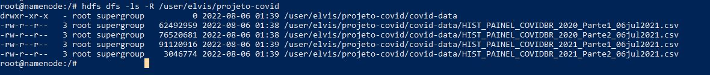
 
 

### 2. Otimizar todos os dados do hdfs para uma tabela Hive particionada por município.

#### 📌 Visualizações
 

* Criando a tabela tb_covide19 no Hive:
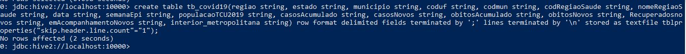
 

* Visualizando a descrição da tabela tb_covide19:
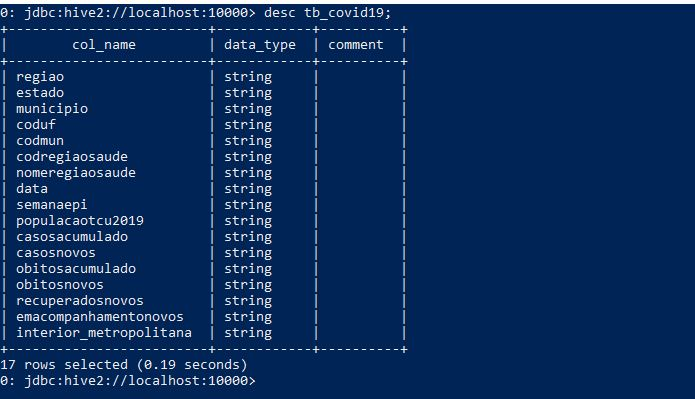

* Select na tabela tb_covide19 vazia:
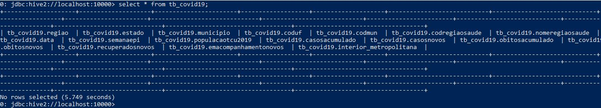

* Load dos dados na tabela:
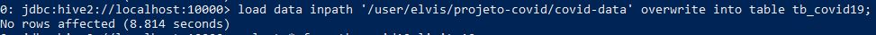

* Select na tabela tb_covide19:
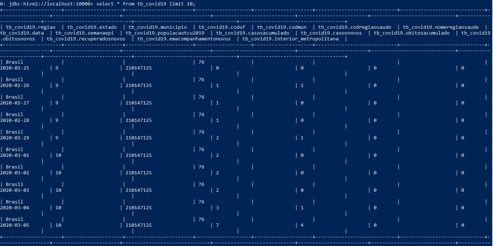
 

* Contando os registros da tabela:
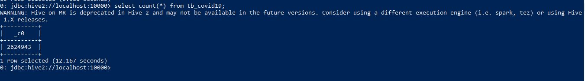
 

* Visualizando os dados distintos da coluna região:
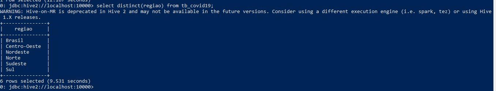
 
 

### 3. Criar as 3 vizualizações pelo Spark com os dados enviados para o HDFS:

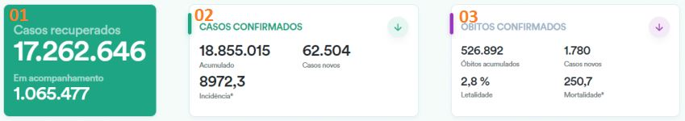

#### 🛠️ Soluções:
 

* Cartão 01: Casos Recuperados e Em acompanhamento:
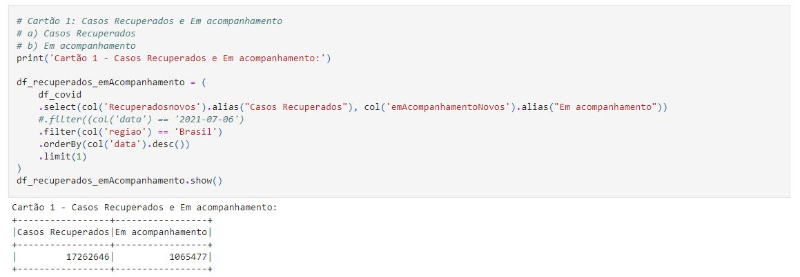
 

* Cartão 02: Casos confirmados:
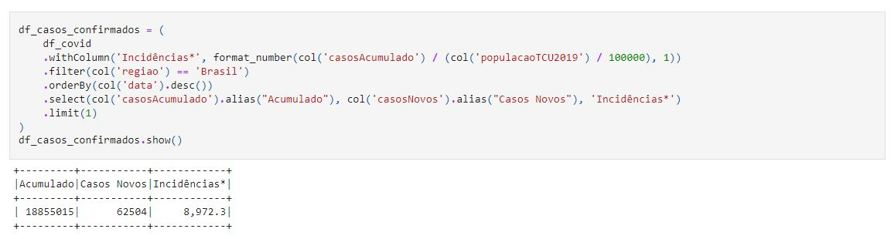
 

* Cartão 3: Óbitos Confirmados:
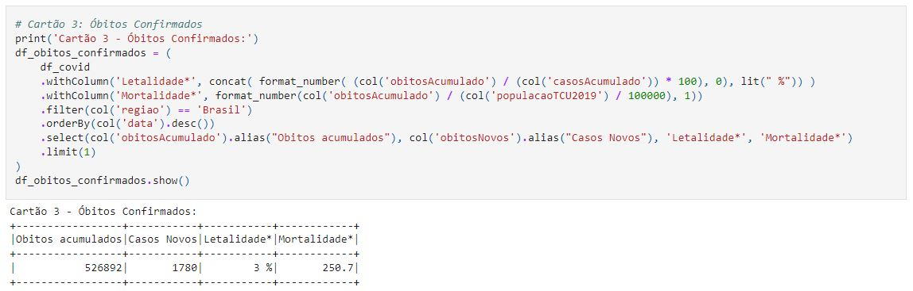
 
 

### 4. Salvar a primeira visualização como tabela Hive.

#### 🛠️ Solução:

* Salvando a visualização do cartão 01 em como tabela hive:
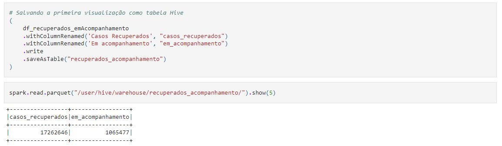
 
 

## 5. Salvar a segunda visualização com formato parquet e compressão snappy:

#### 🛠️ Solução:

* Salvando a visualização do cartão 02 em formato parquet e compressão snappy:
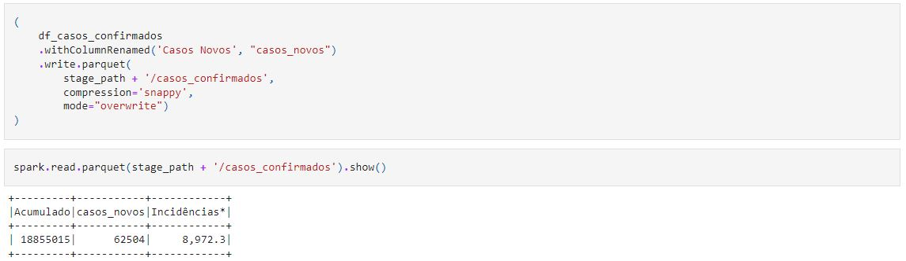
 
 

### 6. Salvar a terceira visualização em um tópico no Kafka:

#### 🛠️ Solução:

* Criando o tópico no Kafka:
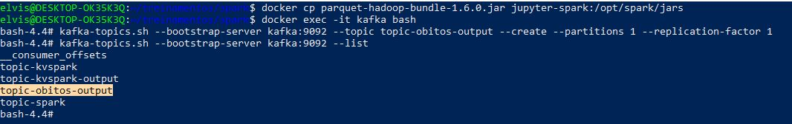
 
* Salvando a visualização do cartão 03 no tópico no Kafka:
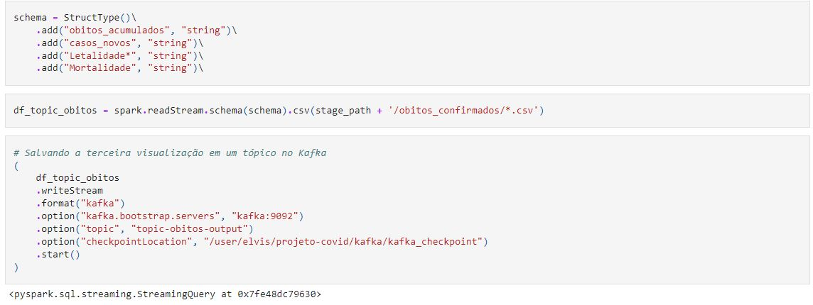
 
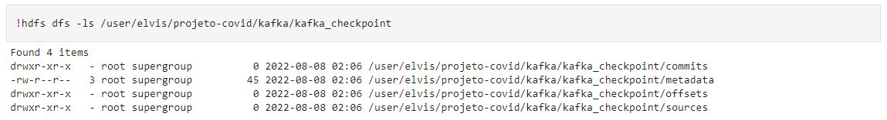
 
 

### 7. Criar a visualização pelo Spark com os dados enviados para o HDFS:

#### 🛠️ Solução:

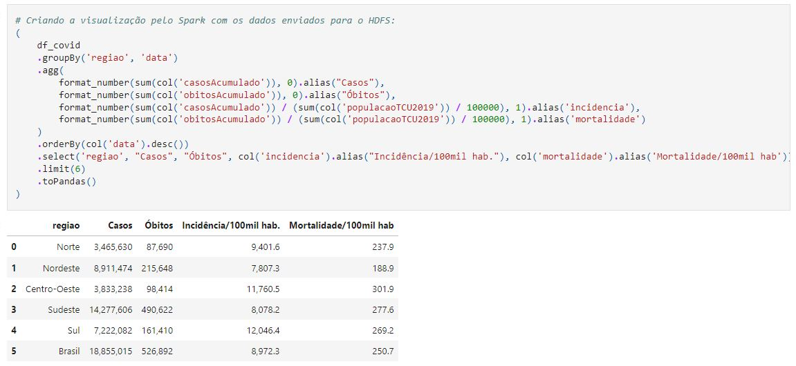
 
 

### 8. Salvar a visualização do exercício 6 em um tópico no Elastic.

#### 🛠️ Solução:
* Em desenvolvimento

 
 

### 9. Criar um dashboard no Elastic para visualização dos novos dados enviados.

#### 🛠️ Solução:
* Em desenvolvimento